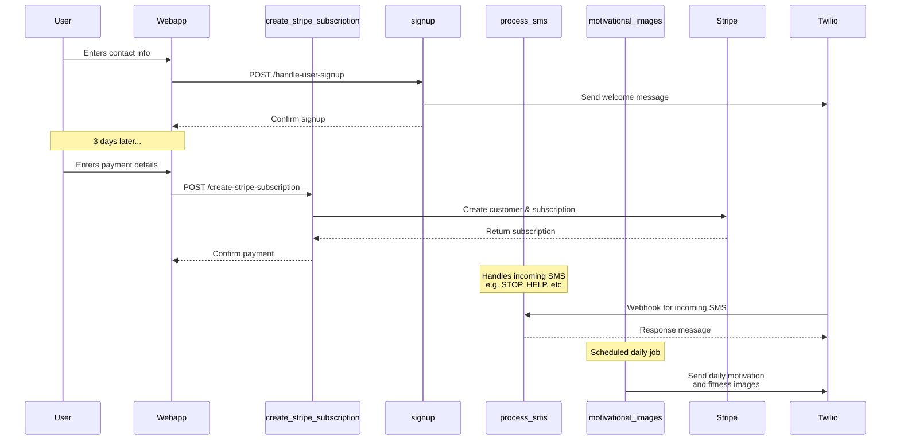

## Update Code

ci/cd will build a new container, push it to GAR, and then deploy it to Cloud Run.

## Update infra

`terraform apply` will redeploy the webapp and the Cloud Function. It will use the latest webapp image. Remember to push code changes.

## Architecture

## supabase sync

check bitwarden

## To Do

- Users can unsubscribe by texting one of the A2P opt-out keywords. We need to add a webhook and a cloud function to update supabase to handle this.