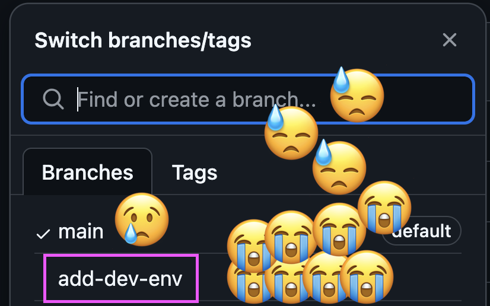

# Bulk up your AI-Assistant with Terraform

I love software engineering because it lets me create new things every single day. As a programmer, I get to conjure novel solutions to problems I've never encountered before - manipulating chaos is my jam. For months, I stubbornly resisted tools like Cursor, Cline and Windsurf. Why? Because I'm passionate about programming and worried these AI assistants would steal my creative thunder rather than amplify it.

Check out this short [video](https://youtu.be/eWrSOGOQKog?t=720) of Cline one-shotting a modern web application for a services company with Claude Sonnet 3.7. It's worth a break.

I gave Cursor a try over the holidays and the past two months have been wildly fun. Cursor amplifies my creative ability by allowing me rapidly explore and iterate on new ideas. But as an infrastructure junkie at heart, what really sold me on AI-assistants was their superability when combined with IaC.

I'll show you what I mean with my goofy toy project, [CaboFit](https://cabo.fit/).

## CaboFit: Killing your braincells, one workout at a time

CaboFit is a thin wrapper around Twilio and a text-to-image model hosted on [Replicate](https://replicate.com/explore). Every morning, CaboFit sends a motivational text to the user, along with a before-after picture pair to inspire them.

If you really trust me, you can send a selfie to CaboFit.


CaboFit will send you an image pair with a motivational quote to inspire you.


If you don't trust me, you can describe yourself and CaboFit will generate an image pair for that description. And if you don't send anything, CaboFit will send you anthropomorphic mushrooms, or ogres.


I made this app because a buddy I work out with asked another pal to text him two beach bod pictures every morning with a "motivational" quote. Someone else in the group said "That should be an app". A third guy said "Wait, you should use AI to make pictures that look like you". I thought that was pretty funny, so I turned a mildly toxic joke into a part-time obsession.

## Terraform: Creatine for your AI-Assistant

Terraform allows us to define infrastructure using declarative configuration files. The first time I wrote Terraform, I was a wee SE1, pair-programming with Steven Kneisler. At the time, I barely even lifted, bro. Steven explained gingerly that I need not click endlessly through a labrynth of public cloud service UIs to enact my dreams. Instead, I could just write some code and watch it do the thing. I felt a burgeoning sense of power coarse through my veins, and grew two inches taller that day.

(Alternatively, add a picture of Steven Kneisler here)


Terraform has key advantages that make it perfect for AI assistants:

1. **Declarative syntax**: Terraform configurations describe the desired end state rather than the steps to get there, making it easier for AI to reason about.

2. **Version control**: Infrastructure changes can be tracked in git alongside application code.

3. **Modularity**: Terraform modules enable reusable components that AI can leverage.

4. **Plan and apply workflow**: The plan output can be used to verify that the written Terraform code is valid before it's applied.

5. **Explicit error messages**: Terraform provides clear and detailed error messages that AI assistants can parse and understand.

Let's look at how this works in practice with CaboFit.

## Case Study: Some CaboFit Terraform

Let's say you have a [javascript file](https://github.com/Harrolee/cabo/blob/d800b001b7de63839c505935c980f2383d0c5ef0/functions/motivational-images/index.js) that sends an LLM-generated text message to a user. Let's say you want to send that message once a day every day at 9am. The very existence of Terraform, indeed, _any_ IaC tool, means that you can describe this desired end state in code. Now that Cursor/Windsurf/Cline exist, you can simply describe the desired end state, and the tool will generate the Terraform code to achieve that end state.

This is the important part: Your AI assistant can know the current state of your deployed infrastructure, and when you express a passing wish, it can generate the IaC to satisfy your desire.

And when it doesn't work, you can show it the error message and ask it to write better IaC.

Here's some of [CaboFit's Terraform](https://github.com/Harrolee/cabo/blob/d800b001b7de63839c505935c980f2383d0c5ef0/_infra/main.tf#L1):

```hcl
# Configure the Google Cloud provider
provider "google" {
  project = var.project_id
  region  = var.region
}

# Create a Cloud Storage bucket for the function source
resource "google_storage_bucket" "function_bucket" {
  name     = "${var.project_id}-function-source"
  location = var.region
  uniform_bucket_level_access = true
}

# Cloud Scheduler configuration
resource "google_cloud_scheduler_job" "daily_motivation" {
  name        = "trigger-daily-motivation"
  description = "Triggers the motivation function daily"
  schedule    = "0 9 * * *"
  time_zone   = "America/New_York"

  http_target {
    http_method = "POST"
    uri         = module.motivation_function.url

    oidc_token {
      service_account_email = google_service_account.function_invoker.email
    }
  }
}
```
This configuration defines the cloud provider (the part that connects Terraform to GCP), the storage bucket that houses our business logic, and the scheduled job that sends a picture pair every morning.


Are you in love yet? The feeling will never fade.

## Features That Make Cabo AI-Friendly

At a high level, CaboFit is six cloud functions, two buckets, and a sign-up SPA in a trench coat. Okay, there's also a Twilio phone number and a Stripe account. But you get the idea. Let's look at how this architecture makes it easy for an AI assistant to understand and modify the codebase, and how it suits an app whose LLM calls need to track both a user's conversation history and the current definition of a coach persona in order to deliver a cohesive customer experience.

### 1. Modular Cloud Functions

Cabo uses a collection of specialized cloud functions, each with a single responsibility:

```
functions/
├── get-user-data/
├── motivational-images/
├── process-sms/
├── signup/
├── stripe-webhook/
├── create-stripe-subscription/
├── create-setup-intent/
└── shared/
    └── coach-personas.js
```

This modular approach allows an AI assistant to focus on one function at a time, making it easier to understand and modify the codebase.

### 2. Infrastructure as Code with Terraform

The entire infrastructure is defined in Terraform, making it transparent and reproducible:

```hcl
# Create ZIP archives for each function
data "archive_file" "motivational_images_zip" {
  type        = "zip"
  source_dir  = "${path.root}/../functions/motivational-images"
  output_path = "${path.root}/tmp/motivational-images.zip"
  excludes    = ["node_modules"]
}

# More function archives...
```

This approach allows an AI assistant to understand how each function is packaged and deployed.

### 3. Shared Code and Configuration

The project uses a shared module for the information that every LLM call needs to have. For example, the `coach-personas.js` file defines different coaching styles:

```javascript
const COACH_PERSONAS = {
  zen_master: {
    name: "Zen Master",
    description: "A peaceful, mindful coach focused on holistic wellness and inner strength",
    traits: [
      "Radiates peaceful zen energy",
      "Uses phrases like 'Listen to your body' and 'Every step counts'",
      "Emphasizes mindfulness and balance",
      "Often references nature and harmony",
      "Ends messages with 'Namaste' or gentle encouragement"
    ],
    // ...
  },
  // Other personas...
};
```

When I decide, arbitrarily, that I want to make the frat_bro coach somehow more aggressive, I can type into a natural-language IDE pane and watch an AI-assistant change code that is defined only in one place in order to change the behavior of the frat_bro coach in every function that needs to know about the frat_bro coach.

## How AI Assistants Leverage This Architecture

With this foundation in place, an AI assistant can perform several deployment-related tasks:

1. **Create new cloud functions**: By understanding the existing patterns, an AI can generate new functions that follow the same structure.

2. **Update infrastructure**: When new requirements emerge, the AI can modify the Terraform configurations to add or update resources.

3. **Deploy changes**: Using the Terraform workflow, the AI can plan and apply changes to the infrastructure.

4. **Fix problems**: By examining logs and error messages, the AI can identify and troubleshoot deployment issues.

## AI Strength Training: Can we make CaboFit fit for Cabo?

### Ken Erwin's End of Human-Readable Code

Developing CaboFit with Cursor and Claude is already more fun than a bucket of pull-tabs. I recently read Ken Erwin's article ["The End of Human-Readable Code: It's Time to Write for AI"](https://www.linkedin.com/pulse/end-human-readable-code-its-time-write-ai-ken-erwin-papmc/) and learned several improvements that could make the party rage even harder. This include:

1. **Context headers**: Clear file-level documentation that explains system context, business rules, and technical dependencies.

2. **Semantic grouping**: Explicit section markers that help AI models understand code organization.

3. **Relationship markers**: Clear indicators of code relationships between different parts of the system.

4. **Type information**: Explicit type hints and schemas that help AI understand data structures. So, **not** javascript. 😅

Implementing these practices in CaboFit would make it even easier for AI assistants to understand and modify the codebase. One of Ken's context header's for the process-sms function might look like this:

```markdown
# Function: process-sms

## Purpose
Processes incoming SMS messages from users and generates appropriate responses.

## Inputs
- From: Phone number of the sender
- Body: Content of the SMS message

## Outputs
- SMS response to the user
- Updated conversation history in storage

## Dependencies
- Twilio API for SMS handling
- OpenAI API for response generation
- Cloud Storage for conversation history
```
I'll implement these and report back.Thanks Ken!

### Geoffrey Huntley Calls Me Out

I learned about [yolo mode](https://forum.cursor.com/t/yolo-mode-is-amazing/36262) last week. 

Huntley points out that developers like me underutilize Cursor by treating it as regular old IDE rather than an autonomous agent. Sorta like how I use my paring blade to cut literally everything when I cook. Instead, Huntley says we should use Cursor to create new [rules](https://docs.cursor.com/context/rules-for-ai) that Cursor will then follow during yolo mode. Read his quick [article](https://ghuntley.com/stdlib/) for an explanation, but promise you'll come back. 

To take full advantage of Cursor's capabilities, I could:

1. **Create more and better Cursor rules**: These rules would enforce coding standards, architectural decisions, and other best practices. My [meager ruleset](https://github.com/Harrolee/cabo/tree/main/.cursor/rules) currently includes such gems as "any time you add a dependency to a cloud function, add it the function's package.json" and "[please, please, please,](https://youtu.be/cF1Na4AIecM?si=oGoqDFmnvSyYCxyu&t=179) any time you create a Terraform resource that interacts with another resource, also define permissions for it to do so". I ought to review this list of [awesome Cursor rules](https://github.com/PatrickJS/awesome-cursorrules) from PatrickJS.

2. **Actually use the tool (enable yolo mode)**: I've been treating Cursor as a pair programming partner. I ought to treat Cursor as a genie.

3. **Implement a feedback loop with tests and a dev environment**: As an infrastructure junkie, I've dishonored myself by writing an app with only one deployment environment and no tests. Shame on me. 

caption:_Please nobody tell Steven Kneisler. I'll be so ashamed, please, please, please... doo doo do doo-oo-oo..._

If I were better person, I could a BASH script that curled my Cloud Functions for debug logs, then write a Cursor rule that requires Claude to run the script after using Terraform to deploy code changes to CaboFit's dev environment. The feedback loop would let Claude iterate on its solution.

Now apply the same concept to database schema changes and new queries, with rule that requires Claude to write and run a benchmark test for every change. And a migration rule, obviously.

### Let's Go Harder: Teaching Claude to Snatch (logs)

Speaking of databases, you know how fast your app becomes when you make data manipulation a responsibility of the database? Well, instead of writing a script to curl logs from the cloud and then writing a Cursor rule that requires Claude to analyze the logs, I could make log-retrieval a capability of the AI assistant agent itself. Anthropic released a toolkit for building AI-assistant enablers, called [MCP](https://modelcontextprotocol.io/introduction). I can make my autonomous genie even more powerful by writing an [MCP server](https://modelcontextprotocol.io/examples) that retrieves and analyzes cloud function logs. This is the index.js file I would deploy as a Cloud Function to enable the log-analysis capability:

```javascript
const { CloudFunctionsServiceClient } = require('@google-cloud/functions');
const { Claude } = require('@anthropic/sdk');

async function analyzeLogs(functionName) {
  // Retrieve logs from Cloud Functions
  const client = new CloudFunctionsServiceClient();
  const logs = await client.getLogs(functionName);
  
  // Analyze logs with Claude
  const claude = new Claude({
    apiKey: process.env.CLAUDE_API_KEY,
  });
  
  const analysis = await claude.messages.create({
    model: "claude-3-opus-20240229",
    system: "You are a log analysis expert. Identify patterns, errors, and optimization opportunities.",
    messages: [
      {
        role: "user",
        content: `Analyze these cloud function logs and provide insights:\n\n${logs}`
      }
    ],
    max_tokens: 1000
  });
  
  return analysis.content;
}
```

## Cool Down: Getting Serious

I'd like to leave you with the idea that Terraform is a concrete example of a process that gives your AI-assistant visibility into the current state of your deployed system. This visibility allows your AI-assistant to make more informed decisions about how components of your system should interact with each other, and how to modify your system to better satisfy your goals.

I also want to leave you with the idea that AI-assistants can be a force multiplier. They can help you write code faster, but they can also help you deploy code faster, and debug problems faster. Like any exercise, you need to put in the work to see results. But when you do, you'll be amazed at what you can accomplish.

So here's a workout plan for you:

1. Learn an IaC tool
2. Structure your codebase to be AI-friendly
3. Ask your AI-assistant to write Terraform to deploy your code
4. Ask your AI-assistant to write tests for your code
5. Write MCP servers to enable your AI-assistant to analyze logs, metrics, and traces
6. Turn on yolo mode, [you already know though](https://youtu.be/0V2VVEH6AX4?si=tuvVc-uy9AFjaJpm&t=90)

---

What aspects of AI-assisted deployment are you most excited about? Have you structured your projects to be AI-friendly? HMU on [LinkedIn](https://www.linkedin.com/in/lee-harrold/) and let me know!


Did you forget about the ogre? I didn't.