# The Tale of the Cabo Payment Flow 🏖️ 💪

## The Story

Picture this: A fitness enthusiast (let's call them Gym Warrior) signs up for CaboFit, dreaming of those perfect beach photos. They enter their details and get a "Welcome to your trial!" message. CaboFit, being the thoughtful app it is, starts sending them daily motivation right away.

Three days pass, filled with workout pics and inspiration. Then, like a friendly gym buddy reminder, CaboFit sends a text: "Hey! Want to keep the motivation flowing? Click here to upgrade!" Our Gym Warrior, now addicted to their daily dose of motivation, clicks the link.

Behind the scenes, it's like a well-choreographed gym routine:
1. The app recognizes them (thanks to their email in the URL - clever!)
2. Shows them the payment form (smooth, like a perfect protein shake)
3. When they enter their card details, Stripe Elements handles the secure collection

When Gym Warrior submits their payment, it's showtime! The app:
1. First makes sure the card is legit (no one likes a bounced payment, right?)
2. Creates their Stripe customer profile (if they're new to Stripe)
3. Sets up their subscription (like signing up for a premium gym membership)
4. Starts sending them even spicier workout motivation! 🌶️

Meanwhile, Stripe's webhook is like that diligent gym manager who keeps all the paperwork in order, making sure our database knows exactly what's going on with the subscription.

## The Technical Dance 💃

```mermaid
sequenceDiagram
    participant User as Gym Warrior
    participant App as CaboFit App
    participant Stripe
    participant Sub as create-stripe-subscription
    participant Webhook as stripe-webhook
    participant DB as Supabase

    Note over User,DB: Trial Period
    User->>App: Signs up for trial
    App->>DB: Creates user profile (trial status)
    
    Note over User,DB: Payment Flow
    User->>App: Clicks payment link in SMS
    App->>Stripe: Create SetupIntent
    Stripe-->>App: Returns SetupIntent
    
    Note over User,DB: Payment Collection
    User->>App: Enters card details
    App->>Stripe: Confirm SetupIntent
    Stripe-->>App: Setup confirmed
    App->>Sub: Create subscription
    Sub->>DB: Get/Create Stripe customer
    Sub->>Stripe: Create subscription
    
    Note over User,DB: Webhook Magic
    Stripe->>Webhook: Subscription event
    Webhook->>DB: Update subscription status
    
    Note over User,DB: Happy Ending
    DB-->>App: Updated status
    App-->>User: Success! Time to get swole! 💪
```

## The Moral of the Story

Like any good workout routine, our payment flow is all about proper form and sequence. Each component knows its role and executes it perfectly, just like a well-coordinated circuit training session. And just as a spotter ensures safety during heavy lifts, our webhook ensures no subscription status update ever gets dropped.

Remember: Whether you're lifting weights or handling payments, it's all about form, consistency, and having a reliable partner watching your back! 🏋️‍♂️ 